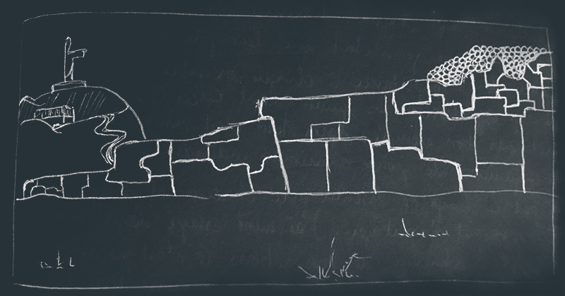

## What did I learn?

La première chose qui m'a frappé en arrivant au Pérou c'est la désagréable sensation qu'on te donne d'être un ATN sur pates. Je crois que si on avait pu me braquer sur place, j'aurai été à poil en moins de 10min. Plus tard, j'ai vu des villes et des villages moins agressifs que Cusco mais toujours à fond sur ma poche. Au final, j'en suis arrivé à modifier mon comportement. Je suis devenu méfiant, moins souriant et moins curieux de parler avec des locaux.

---

J'ai appris la différence entre Incas, Mayas, Aztèques et beaucoup d'autres. Leurs fonctionnements en tant que civilisation est passionant. Que ce soit d'un point de vue économique, culturel, guerrier ou agriculturel.

Grâce à cela, j'ai appris pourquoi leurs constructions sont encore impressionantes et parfaites. Tout était géré par le plaisir de bien faire. La société était un plus plus équilibrée que la notre. Un mélange de communisme et de libéralisme intéressant.

Ça m'a fait mal au coeur de voir les temples dévastés dans les hauteurs de Cusco. Ils ont été détruit parl les espagnols pour installer leur "dieu", pour construire des édifices plus noirs et austères. Des lieux qui sont aujourd'hui concervés pour l'histoire mais dont beaucoup ne croient plus.

---

J'ai pris une photo d'un des plus gros temples Inca de Cusco, elle ressemble à ceci. C'est un mur construit en plusieurs années avec des blocs énormes taillés et polis par des homes qui le construisaient pour eux. Un temple est religieux forcément donc ce n'est pas uniquement pour eux mais contrairement aux églises, ils y entretenaient une certaine vie en communauté dans les murs. Ceci a été détruit par des envahisseurs afin de les convertir à la pratique d'une autre religion (et au nom de cette religion). Aujourd'hui une civilisation autonome et admirable n'existe plus et on vient visier un bout de statue de Jesus alors qu'il y a des centaines de merveilles autour. Il suffit de regarder l'immensité du temple et de la comparer à ce minuscule Christ pour mesurer l'étendu des dégats.

Il y a même une troisième période, la notre. Elle est gouvernée par l'argent et ça se voit même dans certaines rénovations. Il n'y a plus les gros blocs. Il y a des petites pierres bien moches.

---

