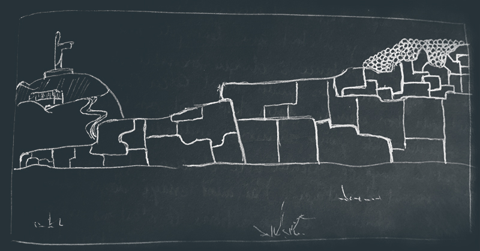

## What did I learn?

La première chose qui m'a frappé en arrivant au Pérou c'est la désagréable sensation qu'on te donne d'être un ATN sur pates. Je crois que si on avait pu me braquer sur place, j'aurai été à poil en moins de 10min. Plus tard, j'ai vu des villes et des villages moins agressifs que Cusco mais toujours à fond sur ma poche. Au final, j'en suis arrivé à modifier mon comportement. Je suis devenu méfiant, moins souriant et moins curieux de parler avec des locaux.

---

J'ai appris la différence entre Incas, Mayas, Aztèques et beaucoup d'autres. Leurs fonctionnements en tant que civilisation est passionant. Que ce soit d'un point de vue économique, culturel, guerrier ou agriculturel.

Grâce à cela, j'ai appris pourquoi leurs constructions sont encore impressionantes et parfaites. Tout était géré par le plaisir de bien faire. La société était un plus plus équilibrée que la notre. Un mélange de communisme et de libéralisme intéressant.

Ça m'a fait mal au coeur de voir les temples dévastés dans les hauteurs de Cusco. Ils ont été détruit parl les espagnols pour installer leur "dieu", pour construire des édifices plus noirs et austères. Des lieux qui sont aujourd'hui concervés pour l'histoire mais dont beaucoup ne croient plus.

---

J'ai pris une photo d'un des plus gros temples Inca de Cusco, elle ressemble à ceci. C'est un mur construit en plusieurs années avec des blocs énormes taillés et polis par des homes qui le construisaient pour eux. Un temple est religieux forcément donc ce n'est pas uniquement pour eux mais contrairement aux églises, ils y entretenaient une certaine vie en communauté dans les murs. Ceci a été détruit par des envahisseurs afin de les convertir à la pratique d'une autre religion (et au nom de cette religion). Aujourd'hui une civilisation autonome et admirable n'existe plus et on vient visier un bout de statue de Jesus alors qu'il y a des centaines de merveilles autour. Il suffit de regarder l'immensité du temple et de la comparer à ce minuscule Christ pour mesurer l'étendu des dégats.

Il y a même une troisième période, la notre. Elle est gouvernée par l'argent et ça se voit même dans certaines rénovations. Il n'y a plus les gros blocs. Il y a des petites pierres bien moches.

---

J'ai essayé de mettre en pratique ce que je voulais développer sur les relations sociales quand je suis partis du Brésil. J'ai profité du groupe réduit au Colca Canyon pour me rapprocher de toutes les personnalités et créer une relations "exclusive" avec chacun. L'exercice n'était pas de faire croire à chacun(e) que je n'étais que leur pote mais plutot de donner de l'importance à chaque membre de l'équipe. J'ai beaucoup observé les guides avant le Colca Canyon et Omar était un bon exemple. Après tout c'est son boulot de rendre une expérience de groupe au niveau individuel.

J'ai pris le temps de discuter avec eux, d'apprendre ce qu'ils avaient à partager. J'ai aussi essayé d'agir dans l'optique du groupe à chaque action. Ce n'est pas nouveau pour moi par conte j'ai vu émerger une communication différente. La culture américaine est différente. J'ai compris qu'ils félicitent plus et plus souvent que nous. Un genre de team spirit plus affiché. En jouant la "raison" et "l'empathie" j'ai développé une reconnaissance du groupe. Alors j'ai apporté le jeu et l'humour. Plusieurs m'ont dit que j'avais un peu un statut de leader alors que je ne l'avais pas spécialement cherché.

Une première conclusion rapide me dirait qu'un leader n'est pas une tête de groupe mais un référent pour chacun. Ce qui l'ammène à avoir un statut dans le groupe. Je comprends mieux maintenant pourquoi à Gobelins on nous disait qu'on ne devient leader que naturellement. Je le savais mais là, je l'ai généré sans le savoir en portant l'attention sur les gens et pas sur les objectifs à atteindre. J'ai d'ailleurs gardé un très bon contact avec tous ces gens et il me parlent régulièrement de leur quotidien.

---

J'ai réappris à marcher et à prendre plaisir dans l'effort physique. Ça m'avait beaucoup manqué mais le fait de faire l'ascenssion du Canyon en 1h40 m'a redonné confiance. Le fait d'être second et d'avoir rattrapé puis doublé 5 groupes m'a aussi redonné le gout du challenge perso que j'avais à vélo. À cette occasion j'ai réappris les battement du coeur, le rythme de marche, le travail des muscles, l'hydratation... Que des réflexes que j'avais mais là, j'en ai pris conscience. C'est d'ailleurs assez agréable de renouer avec son propre corps dans l'exercice. Ça prend du **temps** mais ça aussi ça fait du bien.

## What did I take?

Plusieurs contacts : USA, Pérou, Belgique, Chine, France.

---

Beaucoup de powergrade pour les sels minéraux après une intoxication alimentaire. Et surtout pas d'orange ou de fruits acides.

---

Confiance en moi sur l'exercice physique, la marche et la gestion de groupe.

---

Pas mal de médicaments à cause de mon oreille.

---

J'ai pris plaisir à aider le mec en panne à Lima. Lui aussi je crois :)

## What did I not take?

Le temps. J'ai énormément courru et ce voyage s'est transformé en visite touristique lamentable. J'ai encore remarqué un certain égoïsme chez Jocelyn. Malgré le fait d'avoir essayé de donner le change et d'en parler, je ne vois pas d'évolution. Je ne pense pas qu'il ai quelque chose contre moi en particulier mais il ne pense qu'à lui. Cela rend le voyage à deux très compliqué. Il n'y a pas d'expérience mutuelle, peu de complicité, pas les 400 coups qu'on peut faire entre amis, pas de dérive. Le fait de bouger solo est bien plus cher en bouffe et en fatigue. On ne prévoit pas grand chose à deux mais tout est pensé, mesuré, envisagé, calculé. Aucune marge à la créativité et à la découverte de l'autre. Un seul objectif : dépenser le moins possible, quitte à en faire le moins possible.

Je l'ai vu changer d'avis sur la route à prendre pour le Matchu Pitchu et je l'ai vu prendre soin de moi en allant chez l'ORL mais on cours toujours. On profite de rien, on rencontre personne et mis à part des restos et des lieux à touristes on ne découvre que peu de choses.

Je ne sais pas comment les gens viven, ce qu'ils mangent, comment ils élèvent les jeunes ou ce qu'on apprend à l'école. Je ne connais pas les gens qui travaillent. Puis, l'objectif de rencontrer des personnes dans le web est totalement rapé depuis les Philippines.

Milka, Denis, Vivianne, Laurie, Afra, Arnaud, Seb et même Magali et Chloé m'ont conseillé de voyager seul et de ne pas continuer. Le truc c'est que pour moi ça reste un voyage à deux, en équipe et ça doit certainement faire partie de l'expérience d'avoir à faire face à ce genre de relation.

## What is the next step?

Faire du sport! J'ai définitivement envie de m'y remettre. Je sens la fatigue plus tôt qu'avant et je vois trop de facteurs pouvant l'expliquer. Il faut réduire tout ça.

---

Je vais essayer de laisser Jocelyn tranquile au Canada. Qu'il voyage tout seul. En fait je crois que je vais faire ma vie et regarder si lui me propose de faire quelque chose à deux.

---

J'hésite encore à lui parler aussi franchement. C'est un ami alors je devrais le faire mais j'aimerais bien qu'il parle aussi. Qu'on puisse s'accorder pour de bon.
